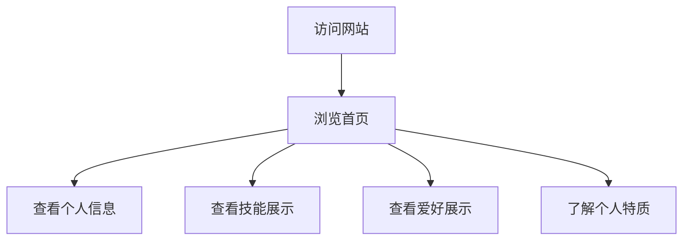

## 1. Product Overview
个人主页网站，展示用户个人信息、技能和爱好，采用极光多巴胺半动态风格设计。
- 主要目的是展示个人专业技能、兴趣爱好和个人特质，为潜在雇主或合作伙伴提供了解渠道。
- 目标用户为招聘方、同学、朋友及其他可能对用户感兴趣的人群。

## 2. Core Features

### 2.1 User Roles
| 角色 | 注册方式 | 核心权限 |
|------|---------------------|------------------|
| 访问者 | 无需注册 | 浏览所有页面内容 |

### 2.2 Feature Module
1. **首页**：英雄区、个人信息、技能展示、爱好展示、个人特质

### 2.3 Page Details
| 页面名称 | 模块名称 | 功能描述 |
|-----------|-------------|---------------------|
| 首页 | 英雄区 | 展示用户姓名、专业，带有极光多巴胺风格的动态背景效果 |
| 首页 | 个人信息 | 展示用户基本信息，包括教育背景、MBTI类型 |
| 首页 | 技能展示 | 展示用户熟练使用的工具和技能，包括Office工具和Python编程 |
| 首页 | 爱好展示 | 展示用户的兴趣爱好，包括吉他弹唱和街舞 |
| 首页 | 个人特质 | 展示用户的个人特质，如领导力和执行力 |

## 3. Core Process
用户访问网站 → 浏览首页内容 → 了解用户个人信息、技能和爱好

## 4. User Interface Design
### 4.1 Design Style
- 主色调：极光紫、霓虹粉、天空蓝、荧光绿
- 次要色调：深灰、白色
- 按钮风格：圆角设计，带有渐变效果和轻微3D感
- 字体：现代无衬线字体，标题使用粗体，正文使用常规字重
- 布局风格：卡片式布局，带有微妙的阴影和分层效果
- 图标风格：简约现代，带有轻微的霓虹效果

### 4.2 Page Design Overview
| 页面名称 | 模块名称 | UI元素 |
|-----------|-------------|-------------|
| 首页 | 英雄区 | 全屏背景，带有极光多巴胺风格的半动态效果，中央展示用户姓名和专业，使用大号字体和渐变文字效果 |
| 首页 | 个人信息 | 卡片式设计，带有微妙的阴影，展示用户教育背景和MBTI类型，使用图标增强视觉效果 |
| 首页 | 技能展示 | 网格布局，每个技能使用图标和进度条展示熟练度，带有悬停动画效果 |
| 首页 | 爱好展示 | 卡片式设计，每个爱好配有相关图标和简短描述，带有轻微的动画效果 |
| 首页 | 个人特质 | 列表式设计，每个特质配有相关图标和简短描述，带有悬停效果 |

### 4.3 Responsiveness
- 桌面优先设计，同时支持平板和移动设备
- 在小屏幕设备上，网格布局自动调整为单列
- 触摸优化，确保在移动设备上的良好交互体验

### 4.4 3D Scene Guidance
- 不使用3D场景，专注于2D设计和动画效果
- 使用CSS动画和JavaScript实现半动态效果
- 背景使用渐变和轻微的动画效果模拟极光效果