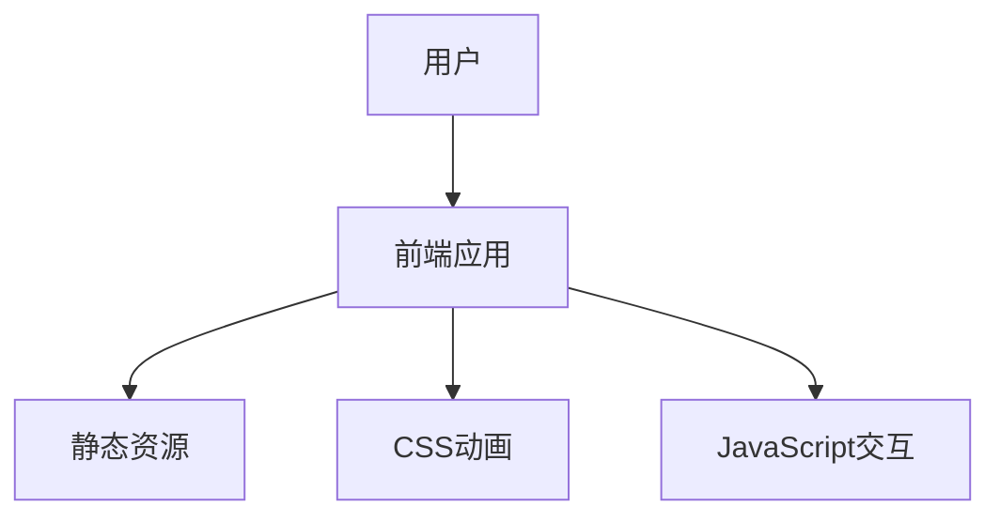

## 1. Architecture Design

## 2. Technology Description
- 前端：React@18 + tailwindcss@3 + vite
- 初始化工具：vite-init
- 后端：无
- 数据库：无

## 3. Route Definitions
| 路由 | 用途 |
|-------|---------|
| / | 首页，展示所有内容 |

## 4. API Definitions
- 无API调用，所有内容静态展示

## 5. Server Architecture Diagram
- 无后端服务，纯前端应用

## 6. Data Model
- 无数据模型，所有内容硬编码在前端代码中